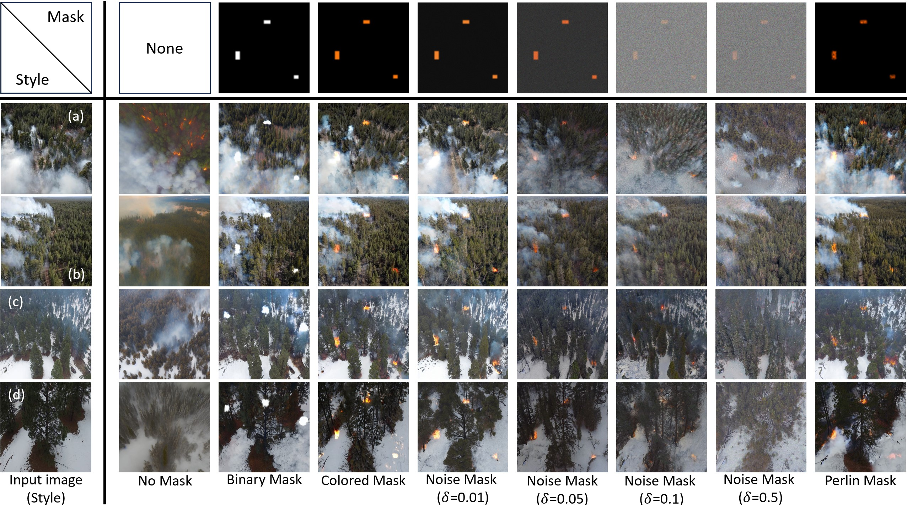
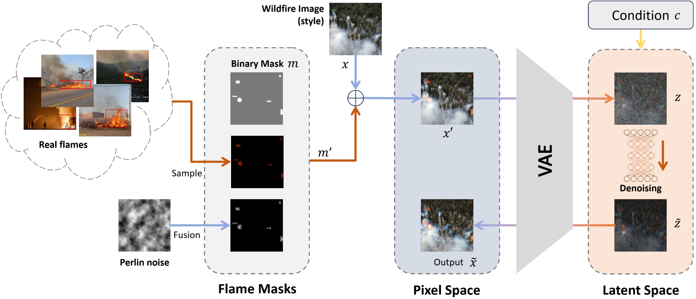
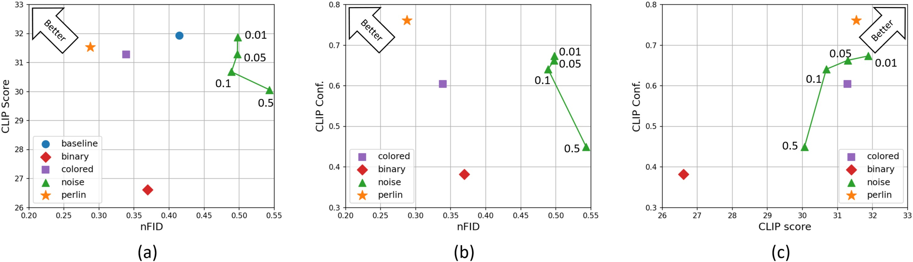
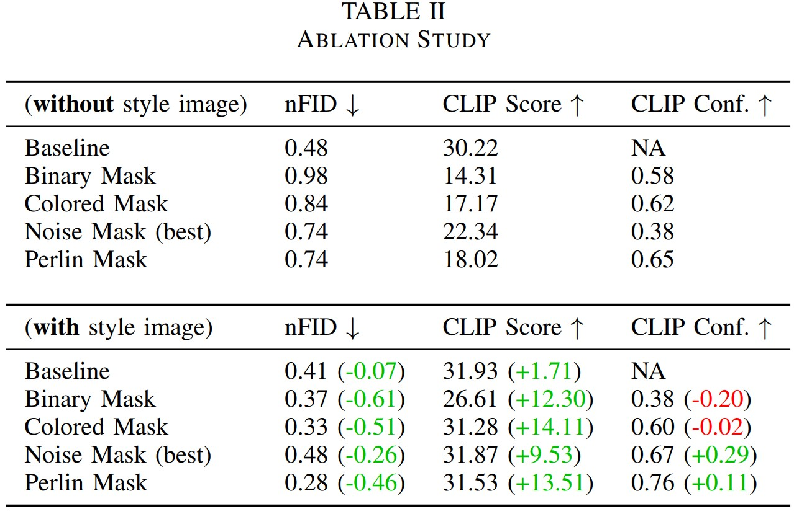

# 🔥 FLAME Diffuser: Wildfire Image Synthesis using Mask Guided Diffusion

A comprehensive repository accompanying the paper [**_FLAME Diffuser: Wildfire Image Synthesis using Mask Guided Diffusion_ (2024)**](https://ieeexplore.ieee.org/document/10826040), published in the IEEE BigData Conference. This repository provides code, datasets, and analyses supporting our large-scale review of wildfire and smoke imagery resources. It includes the full pipeline for mask-guided wildfire generation, Perlin-noise-based mask augmentation, and quantitative evaluation using FID, CLIP Score, and CLIP Confidence. The repository also provides sample datasets, evaluation scripts, and ready-to-run demos for generating and benchmarking high-quality wildfire imagery.  

## 🔍 Overview

FLAME Diffuser is a training-free, diffusion-based framework for synthesizing realistic wildfire images with paired ground truth masks. It introduces a novel mask-guided diffusion process that integrates Perlin noise and augmented flame masks to precisely control the placement and realism of generated fire elements while preserving the original scene’s style. Built upon Stable Diffusion and CLIP-based evaluation, FLAME Diffuser achieves high image fidelity, semantic alignment, and controllable flame generation — making it a powerful tool for data augmentation and wildfire detection research. The framework produces diverse, high-quality wildfire imagery suitable for advancing computer vision models in environmental monitoring, safety, and ecological analysis.

## ⚙️ Quick Tutorial
1. First, please download stable-diffusion-v1-5 model file from: [https://huggingface.co/stable-diffusion-v1-5/stable-diffusion-v1-5/resolve/main/v1-5-pruned.ckpt](https://huggingface.co/stable-diffusion-v1-5/stable-diffusion-v1-5/resolve/main/v1-5-pruned.ckpt) and place it into the `FLAME_SD\models\ldm\stable-diffusion-v1\` folder. <br>

2. Run `Flame_diffuser_perlin_mask.py` as a demo to show the proposed 'perlin_mask' method from the paper.

3. Go to [exp](exp) to check the mask-related functions such as `mask_generator.py` <br>
Run `dataset_eval.py` to produce the results of FID, CLIP Score, and CLIP Confidence. It will generate annotation for the test folder as well.

We will update more details later according to the request. Please contact us anytime if you have questions.

## 🧩 Sample Dataset



---


## 📌 Key Features

- **Training-Free Diffusion Framework:** Generates wildfire images without the need for model training or fine-tuning.
- **Precise Flame Control:** Utilizes noise-based masks for accurate flame placement.
- **Diverse Backgrounds:** Creates images with varied and realistic backgrounds, enhancing model generalizability.
- **High-Quality Dataset:** Introduces FLAME-SD with 10,000 synthesized images for robust model training.

## 🧠 Methodology



1. **Mask Generation:** 
   - Masks are generated to define areas for fire elements using fundamental shapes like rectangles and circles.
   - Perlin noise is added to the masks to create a smoother integration process.

2. **Diffusion Process:**
   - Combines masks with raw images, processed through a Variational Autoencoder (VAE) to generate latent variables.
   - The denoising U-Net refines these variables to produce realistic images guided by text prompts.


## 📊 Experimens



- **High-Quality:** Lowest FID score compared to other methods, indicating better realistic styles.
- **Consistency:** Image content does not shift, the semantic information is well-kept in synthesized images.




---

## 👥 Author

**Sayed Pedram Haeri Boroujeni**  
PhD Student, Clemson University  
Email: sayedpedramhaeri@gmail.com


# 📄 Acknowledgments
This project is supported by the National Science Foundation under Grant Number CNS-2204445. Special thanks to USDA Forest Service and Kaibab National Forest administration. <br>

# 📚 Citation 
<a href="https://doi.ieeecomputersociety.org/10.1109/BigData62323.2024.10826040">FLAME Diffuser: Wildfire Image Synthesis using Mask Guided Diffusion</a>

```
@INPROCEEDINGS {10826040,
author = {Wang, Hao and Haeri Boroujeni, Sayed Pedram and Chen, Xiwen and Li, Huayu and Zhu, Wenhui and Razi, Abolfazl},
booktitle = {2024 IEEE International Conference on Big Data (BigData) },
title = {{ FLAME Diffuser: Wildfire Image Synthesis using Mask Guided Diffusion }},
year = {2024},
volume = {},
ISSN = {},
pages = {6171-6179},
doi = {10.1109/BigData62323.2024.10826040},
url = {https://doi.ieeecomputersociety.org/10.1109/BigData62323.2024.10826040},
publisher = {IEEE Computer Society},
address = {Los Alamitos, CA, USA},
month =Dec}
```
